# Design Document


Authors:

Andrea Bruno (s269705)  
Daniela Di Canio (276062)  
Gaetano Prudente (276096)  
Ruben Rinaldi (278179)

Date: 

17/05/2020

Version: 

1.0 (Initial document)  
2.0 (Backward design)  


# Contents

- [High level design](#package-diagram)
- [Low level design](#class-diagram)
- [Verification traceability matrix](#verification-traceability-matrix)
- [Verification sequence diagrams](#verification-sequence-diagrams)

# Instructions

The design must satisfy the Official Requirements document (see EZGas Official Requirements.md ). <br>
The design must comply with interfaces defined in package it.polito.ezgas.service (see folder ServicePackage ) <br>
UML diagrams **MUST** be written using plantuml notation.

# High level design

The style selected is client - server. Clients can be smartphones, tablets, PCs.
The choice is to avoid any development client side. The clients will access the server using only a browser.

The server has two components: the frontend, which is developed with web technologies (JavaScript, HTML, Css) and is in charge of collecting user inputs to send requests to the backend; the backend, which is developed using the Spring Framework and exposes API to the front-end.
Together, they implement a layered style: Presentation layer (front end), Application logic and data layer (back end).
Together, they implement also an MVC pattern, with the V on the front end and the MC on the back end.


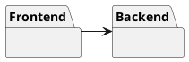


## Front End

The Frontend component is made of:

Views: the package contains the .html pages that are rendered on the browser and that provide the GUI to the user.

Styles: the package contains .css style sheets that are used to render the GUI.

Controller: the package contains the JavaScript files that catch the user's inputs. Based on the user's inputs and on the status of the GUI widgets, the JavaScript controller creates REST API calls that are sent to the Java Controller implemented in the back-end.


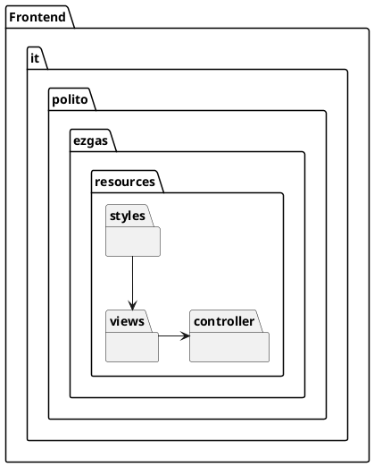

## Back End

The backend  uses a MC style, combined with a layered style (application logic, data).
The back end is implemented using the Spring framework for developing Java Entrerprise applications.

Spring was selected for its popularity and relative simplicity: persistency (M and data layer) and interactions are pre-implemented, the programmer needs only to add the specific parts.

See in the package diagram below the project structure of Spring.

For more information about the Spring design guidelines and naming conventions:  https://medium.com/the-resonant-web/spring-boot-2-0-project-structure-and-best-practices-part-2-7137bdcba7d3


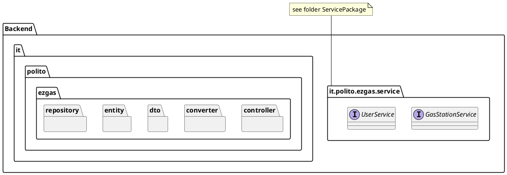


The Spring framework implements the MC of the MVC pattern. The M is implemented in the packages Entity and Repository. The C is implemented in the packages Service, ServiceImpl and Controller. The packages DTO and Converter contain classes for translation services.


**Entity Package**

Each Model class should have a corresponding class in this package. Model classes contain the data that the application must handle.
The various models of the application are organised under the model package, their DTOs(data transfer objects) are present under the dto package.

In the Entity package all the Entities of the system are provided. Entities classes provide the model of the application, and represent all the data that the application must handle.


**Repository Package**

This package implements persistency for each Model class using an internal database.

For each Entity class, a Repository class is created (in a 1:1 mapping) to allow the management of the database where the objects are stored. For Spring to be able to map the association at runtime, the Repository class associated to class "XClass" has to be exactly named "XClassRepository".

Extending class JpaRepository provides a lot of CRUD operations by inheritance. The programmer can also overload or modify them.


**DTO package**

The DTO package contains all the DTO classes. DTO classes are used to transfer only the data that we need to share with the user interface and not the entire model object that we may have aggregated using several sub-objects and persisted in the database.

For each Entity class, a DTO class is created (in a 1:1 mapping).  For Spring the Dto class associated to class "XClass" must be called "XClassDto".  This allows Spring to find automatically the DTO class having the corresponding Entity class, and viceversa.


**Converter Package**

The Converter Package contains all the Converter classes of the project.

For each Entity class, a Converter class is created (in a 1:1 mapping) to allow conversion from Entity class to DTO class and viceversa.

For Spring to be able to map the association at runtime, the Converter class associated to class "XClass" has to be exactly named "XClassConverter".


**Controller Package**

The controller package is in charge of handling the calls to the REST API that are generated by the user's interaction with the GUI. The Controller package contains methods in 1:1 correspondance to the REST API calls. Each Controller can be wired to a Service (related to a specific entity) and call its methods.
Services are in packages Service (interfaces of services) and ServiceImpl (classes that implement the interfaces)

The controller layer interacts with the service layer (packages Service and ServieImpl)
 to get a job done whenever it receives a request from the view or api layer, when it does it should not have access to the model objects and should always exchange neutral DTOs.

The service layer never accepts a model as input and never ever returns one either. This is another best practice that Spring enforces to implement  a layered architecture.


**Service Package**


The service package provides interfaces, that collect the calls related to the management of a specific entity in the project.
The Java interfaces are already defined (see file ServicePackage.zip) and the low level design must comply with these interfaces.


**ServiceImpl Package**

Contains Service classes that implement the Service Interfaces in the Service package.


# Low level design

```plantuml

package it.polito.ezgas.entity{
	class User{
		private Integer userId
		private String userName
		private String password
		private String email
		private Integer reputation
		private Boolean admin

		public Integer getUserId()
		public void setUserId(Integer userId)
		public String getUserName()
		public void setUserName(String userName)
		public String getPassword()
		public void setPassword(String password)
		public String getEmail()
		public void setEmail(String email)
		public User()
		public User(String userName, String password, String email, Integer reputation)
		public Integer getReputation()
		public void setReputation(Integer reputation)
		public Boolean getAdmin()
		public void setAdmin(Boolean admin)
	}

	class GasStation{
		private Integer gasStationId;
		private String gasStationName;
		private String gasStationAddress;
		private boolean hasDiesel;
		private boolean hasSuper;
		private boolean hasSuperPlus;
		private boolean hasGas;
		private boolean hasMethane;
		private boolean hasPremiumDiesel;
		private String carSharing;
		private Double lat;
		private Double lon;
		private Double dieselPrice
		private Double superPrice
		private Double superPlusPrice
		private Double gasPrice
		private Double methanePrice
		private Double premiumDieselPrice;
		private Integer reportUser
		private String reportTimestamp
		private double reportDependability
		private User user

		public Integer getGasStationId()
		public void setGasStationId(Integer gasStationId)
		public String getGasStationName()
		public void setGasStationName(String gasStationName)
		public String getGasStationAddress()
		public void setGasStationAddress(String gasStationAddress)
		public GasStation()
		public GasStation(String gasStationName, String gasStationAddress, boolean hasDiesel, \n
		boolean hasSuper, boolean hasSuperPlus, boolean hasGas, boolean hasMethane, String carSharing,\n
		double lat, double lon, Double dieselPrice, Double superPrice, Double superPlusPrice, \n
		Double gasPrice, Double methanePrice, Integer reportUser, String reportTimestamp,\n
		double reportDependability)
		public double getReportDependability()
		public void setReportDependability(double reportDependability)
		public Integer getReportUser()
		public void setReportUser(Integer reportUser)
		public String getReportTimestamp()
		public void setReportTimestamp(String reportTimestamp)
		public boolean getHasDiesel()
		public void setHasDiesel(boolean hasDiesel)
		public boolean getHasSuper()
		public void setHasSuper(boolean hasSuper)
		public boolean getHasSuperPlus()
		public void setHasSuperPlus(boolean hasSuperPlus)
		public boolean getHasGas()
		public void setHasGas(boolean hasGas)
		public boolean getHasPremiumDiesel()
		public void setHasPremiumDiesel(boolean hasPremiumDiesel)
		public Double getLat()
		public void setLat(Double lat)
		public Double getLon()
		public void setLon(Double lon)
		public Double getDieselPrice()
		public void setDieselPrice(Double dieselPrice)
		public Double getSuperPrice()
		public void setSuperPrice(Double superPrice)
		public Double getSuperPlusPrice()
		public void setSuperPlusPrice(Double superPlusPrice)
		public Double getGasPrice()
		public void setGasPrice(Double gasPrice)
		public Double getMethanePrice()
		public void setMethanePrice(Double methanePrice)
		public Double getPremiumDieselPrice()
		public void setMethanePrice(Double premiumDieselPrice)
		public User getUser()
		public void setUser(User user)
		public boolean getHasMethane()
		public void setHasMethane(boolean hasMethane)
		public double getMethanePrice()
		public void setMethanePrice(double methanePrice)
		public String getCarSharing()
		public void setCarSharing(String carSharing)
	}

	class PriceReport{
		private Integer priceReportId
		private User user
		private double dieselPrice
		private double superPrice
		private double superPlusPrice
		private double gasPrice
		
		public PriceReport(User user, double dieselPrice, double superPrice, \n
		double superPlusPrice, double gasPrice)
		public User getUser()
		public void setUser(User user)
		public double getDieselPrice()
		public void setDieselPrice(double dieselPrice)
		public double getSuperPrice()
		public void setSuperPrice(double superPrice)
		public double getSuperPlusPrice()
		public void setSuperPlusPrice(double superPlusPrice)
		public double getGasPrice()
		public void setGasPrice(double gasPrice)
		public Integer getPriceReportId()
		public void setPriceReportId(Integer priceReportId)
	}


	PriceReport "*" --> User
	GasStation -- "0..1" PriceReport
	GasStation "*" -- "0..1" User
}

package "it.polito.ezgas.controller" {
	'API linked to "service" and contained into interfaces
	interface "GasStationController"{
	class "GasStationController"{
		{method} public GasStationDto getGasStationById(@PathVariable AllGasStations()
		{method} public void saveGasStation(GasStationDto gasStationDto)
		{method} public void deleteUser(Integer gasStationId)
		{method} public List<GasStationDto> getGasStationsByGasolineType(String gasolinetype)
		{method} public List<GasStationDto> getGasStationsByProximity(Double myLat, Double myLon)
		{method} getGasStationsByProximity(Double myLat, Double myLon, Integer myRadius)
		{method} public List<GasStationDto> getGasStationsWithCoordinates(Double myLat, \n
		Double myLon, String gasolineType, String carSharing)
		{method} public List<GasStationDto> getGasStationsWithCoordinates( \nDouble myLat,Double myLon, Integer myRadius, String gasolineType, String carSharing)

		{method} public void setGasStationReport(Integer gasStationId, double dieselPrice,\n
		double superPrice, double superPlusPrice, double gasPrice, double methanePrice, Integer userId)
		public void setGasStationReport(PriceReportDto priceReportDto)
	}

	class "UserController"{
		{method}	public UserDto getUserById(Integer userId)
		{method}	public List<UserDto> getAllUsers()
		{method}	public UserDto saveUser(UserDto userDto)
		{method}	public Boolean deleteUser(Integer userId)
		{method}	public Integer increaseUserReputation(Integer userId)
		{method}	public Integer decreaseUserReputation(Integer userId)
		{method}	public LoginDto login(IdPw credentials)
	}

	class "HomeController"{
		{method}	public String admin()
		{method}	public String index()
		{method}	public String map()
		{method}	public String login()
		{method}	public String update()
		{method}	public String signup()
	}

}

package "it.polito.ezgas.converter" {
	class UserConverter{
		public static User toUser (UserDto userDto)
		public static UserDto toUserDto (User user)
		public static List<UserDto> toUserDtoList(List<User> userList)
		public static List<User> toUserList(List<UserDto> userDtoList)
	}

	class GasStationConverter{
		public static GasStationDto toGasStationDto(GasStation gasStation)
		public static GasStation toGasStation(GasStationDto gasStationDto)
		public static List<GasStationDto> toGasStationDtoList(List<GasStation> gasStationList)
		public static List<GasStation> toGasStationList(List<GasStationDto> gasStationDtoList)
	}
}

package "it.polito.ezgas.dto" {
class UserDto{
		Integer userId
		String userName
		String password
		String email
		Integer reputation
		Boolean admin

		public UserDto(Integer userId, String userName, String password, \n
		String email, Integer reputation)
		public UserDto(Integer userId, String userName, String password, \n
		String email, Integer reputation, Boolean admin)
		public UserDto()
		public Integer getUserId()
		public void setUserId(Integer userId)
		public String getUserName()
		public void setUserName(String userName)
		public String getPassword()
		public void setPassword(String password)
		public String getEmail()
		public void setEmail(String email)
		public Integer getReputation()
		public void setReputation(Integer reputation)
		public Boolean getAdmin()
		public void setAdmin(Boolean admin)
	}

	class GasStationDto{
		Integer gasStationId
		String gasStationName
		String gasStationAddress
		boolean hasDiesel
		boolean hasSuper
		boolean hasSuperPlus
		boolean hasGas
		boolean hasMethane
		boolean hasPremiumDiesel
		private String carSharing
		double lat
		double lon
		Double dieselPrice
		Double superPrice
		Double superPlusPrice
		Double gasPrice
		Double methanePrice
		Double premiumDieselPrice
		Integer reportUser
		UserDto userDto
		String reportTimestamp
		double reportDependability
		List<PriceReportDto> priceReportDtos = new ArrayList<>()
	
		public GasStationDto(Integer gasStationId, String gasStationName, String gasStationAddress, \n
		boolean hasDiesel, boolean hasSuper, boolean hasSuperPlus, boolean hasGas,\n
		boolean hasMethane, String carSharing, double lat, double lon, Double dieselPrice, \n
		Double superPrice, Double superPlusPrice, Double gasPrice, Double methanePrice,\n
		Integer reportUser, String reportTimestamp, double reportDependability)
		public double getReportDependability()
		public void setReportDependability(double reportDependability)
		public GasStationDto()
		public Integer getGasStationId()
		public void setGasStationId(Integer gasStationId)
		public String getGasStationName()
		public void setGasStationName(String gasStationName)
		public String getGasStationAddress()
		public void setGasStationAddress(String gasStationAddress)
		public boolean getHasDiesel()
		public void setHasDiesel(boolean hasDiesel)
		public Boolean getHasSuper()
		public void setHasSuper(Boolean hasSuper)
		public Boolean getHasSuperPlus()
		public void setHasSuperPlus(Boolean hasSuperPlus)
		public Boolean getHasGas()
		public void setHasGas(Boolean hasGas)
		public Boolean getHasPremiumDiesel()
		public void setHasGas(Boolean hasPremiumDiesel)
		public double getLat()
		public void setLat(Double lat)
		public double getLon()
		public void setLon(Double lon)
		public Double getDieselPrice()
		public void setDieselPrice(Double dieselPrice)
		public Double getSuperPrice()
		public void setSuperPrice(Double superPrice)
		public Double getSuperPlusPrice()
		public void setSuperPlusPrice(Double superPlusPrice)
		public Double getGasPrice()
		public void setGasPrice(Double gasPrice)
		public Double getPremiumDieselPrice()
		public void setPremiumDieselPrice(Double premiumDieselPrice)
		public List<PriceReportDto> getPriceReportDtos()
		public void setPriceReportDtos(List<PriceReportDto> priceReportDtos)
		public Integer getReportUser()
		public void setReportUser(Integer reportUser)
		public String getReportTimestamp()
		public void setReportTimestamp(String reportTimestamp)
		public UserDto getUserDto()
		public void setUserDto(UserDto userDto)
		public boolean getHasMethane()
		public void setHasMethane(boolean hasMethane)
		public double getMethanePrice()
		public void setMethanePrice(double methanePrice)
		public void setHasSuper(boolean hasSuper)
		public void setHasSuperPlus(boolean hasSuperPlus)
		public void setHasGas(boolean hasGas)
		public String getCarSharing()
		public void setCarSharing(String carSharing)
	}

	class PriceReportDto{
		Integer priceReportId
		User user
		double dieselPrice
		double superPrice
		double superPlusPrice
		double gasPrice

		public PriceReportDto(Integer priceReportId, User user, double dieselPrice,\n
		double superPrice, double superPlusPrice, double gasPrice)
		public Integer getPriceReportId()
		public void setPriceReportId(Integer priceReportId)
		public User getUser()
		public void setUser(User user)
		public double getDieselPrice()
		public void setDieselPrice(double dieselPrice)
		public double getSuperPrice()
		public void setSuperPrice(double superPrice)
		public double getSuperPlusPrice()
		public void setSuperPlusPrice(double superPlusPrice)
		public double getGasPrice()
		public void setGasPrice(double gasPrice)
	}

	class LoginDto{
		Integer userId
		String userName
		String token
		String email
		Integer reputation
		Boolean admin

		public LoginDto (Integer userId, String userName, String token, \n
		String email, Integer reputation)
		public LoginDto()
		public Integer getUserId()
		public void setUserId(Integer userId)
		public String getUserName()
		public void setUserName(String userName)
		public String getToken()
		public void setToken(String token)
		public String getEmail()
		public void setEmail(String email)
		public Integer getReputation()
		public void setReputation(Integer reputation)
		public Boolean getAdmin()
		public void setAdmin(Boolean admin)
	}

	class IdPw{
		private String user
		private String pw

		public IdPw(String id, String pw)
		public IdPw()
		public String getUser()
		public void setUser(String user)
		public String getPw()
		public void setPw(String pw)
	}


	PriceReportDto "*" --> UserDto
	GasStationDto -- "0..1" PriceReportDto
	GasStationDto "*" -- "0..1" UserDto
}

package "it.polito.ezgas.repository" {
	interface UserRepository{
		public List<User> findUserByAdmin(boolean admin)
		public User findUserByEmail(String email)
	}

	interface GasStationRepository{
	public List<GasStation> findGasStationByHasDieselOrderByDieselPriceAsc(boolean hasDiesel)
	public List<GasStation> findGasStationByHasSuperOrderBySuperPriceAsc(boolean hasSuper)
	public List<GasStation> findGasStationByHasSuperPlusOrderBySuperPlusPriceAsc(boolean hasSuperPlus)
	public List<GasStation> findGasStationByHasGasOrderByGasPriceAsc(boolean hasGas)
	public List<GasStation> findGasStationByHasMethaneOrderByMethanePriceAsc(boolean hasMethane)
	public List<GasStation> findGasStationByCarSharing(String carSharing)
	public List<GasStation> findGasStationByLatBetweenAndLonBetween(double latStart, \n
	double latEnd, double lonStart, double lonEnd)
	}

}

package "it.polito.ezgas.service"  as ps {
   interface "GasStationService"{
    GasStationDto getGasStationById(Integer gasStationId) throws InvalidGasStationException
    GasStationDto saveGasStation(GasStationDto gasStationDto) throws PriceException, GPSDataException
    List<GasStationDto> getAllGasStations()
    Boolean deleteGasStation(Integer gasStationId) throws InvalidGasStationException
    List<GasStationDto> getGasStationsByGasolineType(String gasolinetype) throws InvalidGasTypeException
	List<GasStationDto> getGasStationsByProximity(double lat, double lon) throws GPSDataException
	List<GasStationDto> getGasStationsWithCoordinates(double lat, double lon, String gasolinetype,\n
	String carsharing) throws InvalidGasTypeException, GPSDataException
	List<GasStationDto> getGasStationsWithoutCoordinates(String gasolinetype, String carsharing)\n
	throws InvalidGasTypeException
	void setReport(Integer gasStationId, double dieselPrice, double superPrice, double superPlusPrice,\n
	double gasPrice, double methanePrice, Integer userId) throws InvalidGasStationException,\n
	PriceException, InvalidUserException
	List<GasStationDto> getGasStationByCarSharing(String carSharing)
   }

   interface "UserService"{
    UserDto getUserById(Integer userId) throws InvalidUserException
    UserDto saveUser(UserDto userDto)
    List<UserDto> getAllUsers()
    Boolean deleteUser(Integer userId) throws InvalidUserException
    LoginDto login(IdPw credentials) throws InvalidLoginDataException
    Integer increaseUserReputation(Integer userId) throws InvalidUserException
    Integer decreaseUserReputation(Integer userId) throws InvalidUserException
   }
}

package "it.polito.ezgas.serviceImpl"  as ps {
   interface "GasStationServiceImpl"{
    GasStationDto getGasStationById(Integer gasStationId) throws InvalidGasStationException
    GasStationDto saveGasStation(GasStationDto gasStationDto) throws PriceException, GPSDataException
    List<GasStationDto> getAllGasStations()
    Boolean deleteGasStation(Integer gasStationId) throws InvalidGasStationException
    List<GasStationDto> getGasStationsByGasolineType(String gasolinetype) throws InvalidGasTypeException
	List<GasStationDto> getGasStationsByProximity(double lat, double lon) throws GPSDataException
	List<GasStationDto> getGasStationsWithCoordinates(double lat, double lon, String gasolinetype,\n
	String carsharing) throws InvalidGasTypeException, GPSDataException
	List<GasStationDto> getGasStationsWithoutCoordinates(String gasolinetype, String carsharing)\n
	throws InvalidGasTypeException
	void setReport(Integer gasStationId, double dieselPrice, double superPrice, double superPlusPrice,\n
	double gasPrice, double methanePrice, Integer userId) throws InvalidGasStationException,\n
	PriceException, InvalidUserException
	List<GasStationDto> getGasStationByCarSharing(String carSharing)
   }

   interface "UserServiceImpl"{
    UserDto getUserById(Integer userId) throws InvalidUserException
    UserDto saveUser(UserDto userDto)
    List<UserDto> getAllUsers()
    Boolean deleteUser(Integer userId) throws InvalidUserException
    LoginDto login(IdPw credentials) throws InvalidLoginDataException
    Integer increaseUserReputation(Integer userId) throws InvalidUserException
    Integer decreaseUserReputation(Integer userId) throws InvalidUserException
   }
}
PriceReportDto -- User

GasStationConverter -- GasStationDto
GasStationConverter -- GasStation

UserConverter -- UserDto
UserConverter -- User

GasStationRepository -- GasStation
UserRepository --  User

GasStationService -- GasStationServiceImpl
GasStationService -- GasStationDto

UserService -- UserServiceImpl
UserService -- IdPw
UserService -- LoginDto
UserService -- UserDto

GasStationServiceImpl -- GasStationDto
GasStationServiceImpl -- GasStation
GasStationServiceImpl -- GasStationConverter
GasStationServiceImpl -- GasStationRepository

UserServiceImpl -- UserConverter
UserServiceImpl -- IdPw
UserServiceImpl -- LoginDto
UserServiceImpl -- UserDto
UserServiceImpl -- User
UserServiceImpl -- UserRepository

GasStationController -- GasStationDto 
GasStationController -- GasStationService

UserController -- IdPw
UserController -- LoginDto
UserController -- UserDto
UserController -- UserService

```


# Verification traceability matrix

|             | FR1 | FR1.1 | FR1.2 | FR1.3 | FR1.4 | FR2 | FR3 | FR3.1 | FR3.2 | FR3.3 | FR4 | FR4.1 | FR4.2 | FR4.3 | FR4.4 | FR4.5 | FR5 | FR5.1 | FR5.2 | FR5.3 |
| ----------- | ----------- | ----------- | ----------- | ----------- | ----------- | ----------- | ----------- | ----------- | ----------- | ----------- | ----------- | ----------- | ----------- | ----------- | ----------- | ----------- | ----------- | ----------- | ----------- | ----------- |
| Class 1: User 		| X | X | X | X | X | X |  |  |  |  |  |  |  |  |  |  |  | X |  |  |
| Class 2: GasStation |  |  |  |  |  |  | X | X | X | X | X | X | X | X | X | X |  | X | X | X |
| Class 3: PriceReport |  |  |  |  |  |  |  |  |  |  |  |  |  | X | X | X | X | X | X | X |
| Class 6: UserConverter | X | X | X | X | X | X |  |  |  |  |  |  |  |  |  |  |  | X |  |  |
| Class 7: GasStationConverter |  |  |  |  |  |  | X | X | X | X | X | X | X | X | X | X |  | X | X | X |
| Class 11: UserDto | X | X | X | X | X | X |  |  |  |  |  |  |  |  |  |  |  | X |  |  |
| Class 12: GasStationDto |  |  |  |  |  |  | X | X | X | X | X | X | X | X | X | X |  | X | X | X |
| Class 13: PriceReporttDto |  |  |  |  |  |  |  |  |  |  |  |  |  | X | X | X | X | X | X | X |
| Class 13: IdPw | X |  |  |  |  |  |  |  |  |  |  |  |  |  |  |  |  |  |  |  |
| Class 13: LoginDto | X |  |  |  |  | X |  |  |  |  |  |  |  |  |  |  |  |  |  |  |
| Class 16: UserRepository | X | X | X | X | X | X |  |  |  |  |  |  |  |  |  |  |  | X |  |  |
| Class 17: GasStationRepository |  |  |  |  |  |  | X | X | X | X | X | X | X | X | X | X |  | X | X | X |
| Interface 1: GasStationController |  |  |  |  |  |  | X | X | X | X | X | X | X | X | X | X |  | X | X | X |
| Interface 2: UserController | X | X | X | X | X | X |  |  |  |  |  |  |  |  |  |  |  | X |  |  |
| Interface 2: HomeController | X | X |  |  |  |  |  |  |  |  | X | X | X | X |  |  |  |  |  |  |
| Interface 3: GasStationService |  |  |  |  |  |  | X | X | X | X | X | X | X | X | X | X |  | X | X | X |
| Interface 4: UserService | X | X | X | X | X | X |  |  |  |  |  |  |  |  |  |  |  | X |  |  |


# Verification sequence diagrams

## Use case 1, UC1 - Create User Account
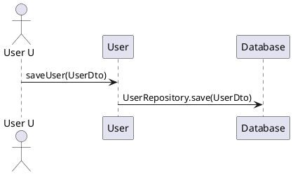

## Use case 2, UC2 - Modify user account


## Use case 3, UC3 - Delete user account


## Use case 4, UC4 - Create Gas Station 
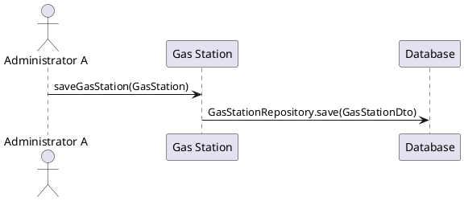

## Use case 5, UC5 - Modify Gas Station information


## Use case 6, UC6 - Delete Gas Station 
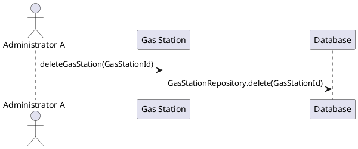

## Use case 7, UC7 - Report fuel price for a gas station
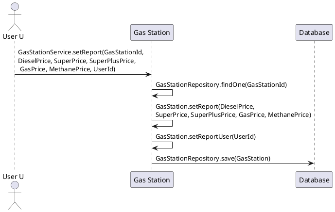

## Use case 8, UC8 - Obtain price of fuel for gas stations in a certain geographic area
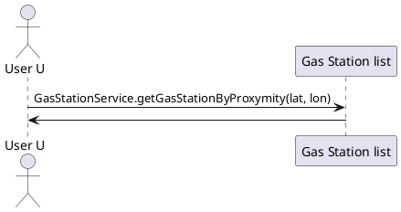

## Use case 8, UC8 - Variant: restrict to a certain fuel type
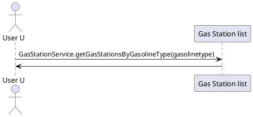

## Use case 8, UC8 - Variant: restrict to car sharing
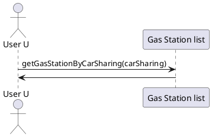

## Use case 8, UC8 - Variant: sort by price, for a fuel type


## Use case 8, UC8 - sort by distance, for a fuel type
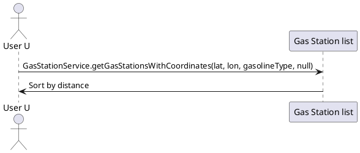

## Use case 9, UC9 - Update trust level of price list
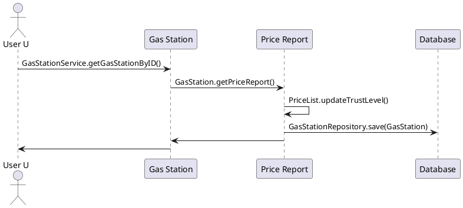

## Use case 10, UC10 - Evaluate Price - Scenario 1
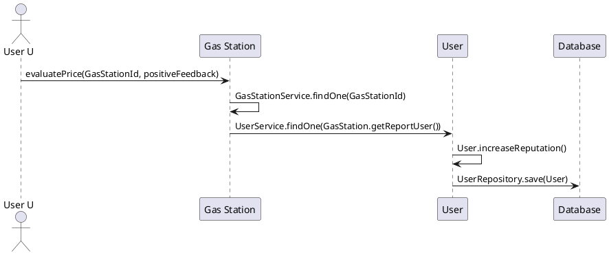
## Use case 10, UC10 - Evaluate price - Scenario 2
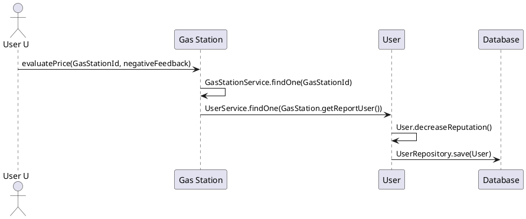

