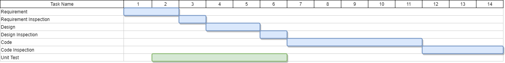
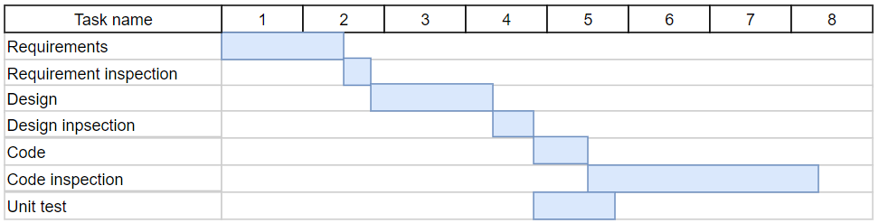

# Project Estimation  

Authors:   
Andrea Bruno (s269705)  
Daniela Di Canio (276062)  
Gaetano Prudente (276096)  
Ruben Rinaldi (278179)

Date:  22/06/2020

Version:   
1.0  Initial estimations  
2.0 New estimations

# Contents

- [Estimate by product decomposition](#estimate-by-product-decomposition)
- [Estimate by activity decomposition](#estimate-by-activity-decomposition)

# Estimation approach

<Consider the EZGas  project as described in YOUR requirement document, assume that you are going to develop the project INDEPENDENT of the deadlines of the course>

# Estimate by product decomposition

### 

|             | Estimate                        |             
| ----------- | ------------------------------- |  
| NC =  Estimated number of classes to be developed   |                24             |             
|  A = Estimated average size per class, in LOC       |                 70           | 
| S = Estimated size of project, in LOC (= NC * A) | 1680|
| E = Estimated effort, in person hours (here use productivity 10 LOC per person hour)  |      168                                |   
| C = Estimated cost, in euro (here use 1 person hour cost = 30 euro) |5040 | 
| Estimated calendar time, in calendar weeks (Assume team of 4 people, 8 hours per day, 5 days per week ) |  1,1                        |           

## New estimates

### 

|             | Estimate                        |             
| ----------- | ------------------------------- |  
| NC =  Estimated number of classes to be developed   |                30             |             
|  A = Estimated average size per class, in LOC       |                 100           | 
| S = Estimated size of project, in LOC (= NC * A) | 3000|
| E = Estimated effort, in person hours (here use productivity 10 LOC per person hour)  |      300                               |   
| C = Estimated cost, in euro (here use 1 person hour cost = 30 euro) |9000 | 
| Estimated calendar time, in calendar weeks (Assume team of 4 people, 8 hours per day, 5 days per week ) |  1,9                        |         

The new estimates are not so far from the original ones: we now estimate more classes (and then more hours) than before, and more classes than the actual EZGas project, since our original requirements had more elements in them.

# Estimate by activity decomposition

### 

|         Activity name    | Estimated effort (person hours)   |             
| ----------- | ------------------------------- | 
| Requirement            | 64|
| Requirement Inspection | 32|
| Design                 | 64|
| Design Inspection      | 32|
| Coding                 | 160|
| Code Inspection        | 96|
| Unit Test              |160|

### Gantt

## New estimates

### 

|         Activity name    | Estimated effort (person hours)   |             
| ----------- | ------------------------------- | 
| Requirement            | 45|
| Requirement Inspection |  7|
| Design                 | 45|
| Design Inspection      | 15|
| Coding                 | 20|
| Code Inspection        | 70|
| Unit Test              | 27|

### Gantt

We provided higher estimations, expecially for the coding section, because we didn't know well how much time it would've taken, and to be more conservative we provided an higher number.