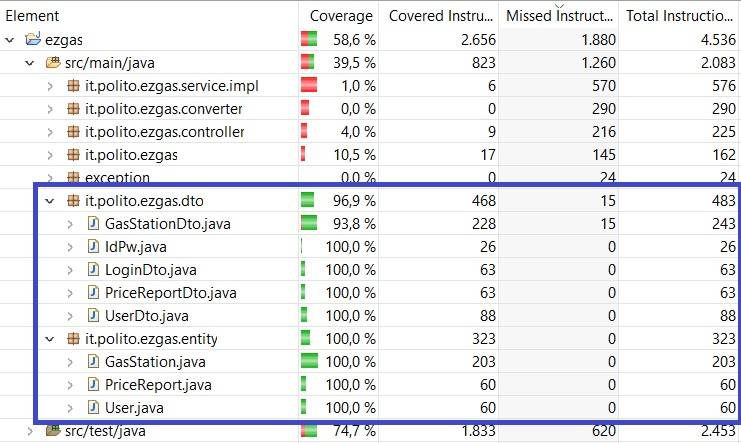

# Unit Testing Documentation

Authors:

Andrea Bruno (s269705)  
Daniela Di Canio (276062)  
Gaetano Prudente (276096)  
Ruben Rinaldi (278179)

Date:

11/06/2020

Version:

1.0
2.0 Update (V2.0)

# Contents

- [Black Box Unit Tests](#black-box-unit-tests)

- [White Box Unit Tests](#white-box-unit-tests)

# Black Box Unit Tests

Unit test is performed on classes that don't heavily rely on others, in our case those are the classes in Entity and Dto packages.
For each getter/setter of classes in Entity and Dto packages, the unit test depends on the type of the attribute (Integer, String, boolean, double or another object), and is represented by its generic black box structure, detailed below. Testing each combination of parameter values foe each edge condition is not feasible nor useful, so a test on each constructor is done.

Each original class is tested in a separate test class in a package with the same name as the original one, and each test method is named after the attribute of which it's testing the getter and setter (constructors with no parameters are tested by a "emptyConstructor" method, and constructors with parameters are tested in a "constructor" method).

To monitor the changes in the second version of the project, new attributes in GasStation and GasStationDto required new tests, and other minor changes were done to other tests, but the general structure remains the same.

 ## **Generic empty constructor**

**Criteria for Generic empty constructor:**
	
 None

**Predicates for Generic empty constructor:**

None

**Boundaries**:

None

**Combination of predicates**:

| Valid / Invalid | Description of the test case | JUnit test case |
|-------|-------|-------|
|V      |Constructor() -> new Object|  |

 

 ## **Generic constructor with parameters**

**Criteria for Generic constructor with parameters:**
	
 None (Correctness of each edge case examined in getter-setter tests)

**Predicates for Generic constructor with parameters:**

None

**Boundaries**:

None

**Combination of predicates**:

| Valid / Invalid | Description of the test case | JUnit test case |
|-------|-------|-------|
|V      |Constructor(values...) -> new Object (check all fields) |  |

 

 ## **Generic getInteger**

**Criteria for Generic getInteger:**
	
- Value of int

**Predicates for Generic getInteger:**

None

**Boundaries**:

| Criteria | Boundary values |
| -------- | --------------- |
|Value of int| minint, minint+1, maxint-1, maxint |

**Combination of predicates**:

|Value of int | Valid / Invalid | Description of the test case | JUnit test case |
|----|---|-------|-------|
|minint |V      |getInteger() -> minint |  |
|minint+1 |V      |getInteger() -> minint+1 |  |
|maxint-1 |V      |getInteger() -> maxint-1 |  |
|maxint |V      |getInteger() -> maxint |  |

 

 ## **Generic setInteger**

**Criteria for Generic setInteger:**
	
- Value of int

**Predicates for Generic setInteger:**

None

**Boundaries**:

| Criteria | Boundary values |
| -------- | --------------- |
|Value of int| minint, minint+1, maxint-1, maxint |

**Combination of predicates**:

|Value of int | Valid / Invalid | Description of the test case | JUnit test case |
|----|---|-------|-------|
|minint |V      |setInteger(minint) -> value set |  |
|minint+1 |V      |setInteger(minint+1) -> value set |  |
|maxint-1 |V      |setInteger(maxint-1) -> value set |  |
|maxint |V      |setInteger(maxint) -> value set |  |

 

 ## **Generic getString**

**Criteria for Generic getString:**
	
- Value of string

**Predicates for Generic getString:**

None

**Boundaries**:

| Criteria | Boundary values |
| -------- | --------------- |
|Value of string| null, not null |

**Combination of predicates**:

|Value of string | Valid / Invalid | Description of the test case | JUnit test case |
|----|---|-------|-------|
|null |V      |getString() -> null |  |
|not null ("abc") |V      |getString() -> "abc" |  |

 

 ## **Generic setString**

**Criteria for Generic setString:**
	
- Value of string

**Predicates for Generic setString:**

None

**Boundaries**:

| Criteria | Boundary values |
| -------- | --------------- |
|Value of string| null, not null |

**Combination of predicates**:

|Value of string | Valid / Invalid | Description of the test case | JUnit test case |
|----|---|-------|-------|
|null |V      |setString(null) -> value set |  |
|not null ("abc") |V      |setString("abc") -> value set |  |

 

 ## **Generic getBoolean**

**Criteria for Generic getBoolean:**
	
- Value of boolean

**Predicates for Generic getBoolean:**

None

**Boundaries**:

| Criteria | Boundary values |
| -------- | --------------- |
|Value of boolean| true, false |

**Combination of predicates**:

|Value of boolean | Valid / Invalid | Description of the test case | JUnit test case |
|----|---|-------|-------|
|true |V      |getBoolean() -> true |  |
|false|V      |getBoolean() -> false |  |

 

 ## **Generic setBoolean**

**Criteria for Generic setBoolean:**
	
- Value of boolean

**Predicates for Generic setBoolean:**

None

**Boundaries**:

| Criteria | Boundary values |
| -------- | --------------- |
|Value of boolean| true, false |

**Combination of predicates**:

|Value of boolean | Valid / Invalid | Description of the test case | JUnit test case |
|----|---|-------|-------|
|true |V      |setBoolean(true) -> value set |  |
|false |V      |setBoolean(false) -> value set |  |

 

 ## **Generic getDouble**

**Criteria for Generic getDouble:**
	
- Value of double

**Predicates for Generic getDouble:**

None

**Boundaries**:

| Criteria | Boundary values |
| -------- | --------------- |
|Value of double| mindouble, mindouble+1, maxdouble-1, maxdouble |

**Combination of predicates**:

|Value of double | Valid / Invalid | Description of the test case | JUnit test case |
|----|---|-------|-------|
|mindouble |V      |getDouble() -> mindouble (given tolerance) |  |
|mindouble+1 |V      |getDouble() -> mindouble+1 (given tolerance) |  |
|maxdouble-1 |V      |getDouble() -> maxdouble-1 (given tolerance) |  |
|maxdouble |V      |getDouble() -> maxdouble (given tolerance) |  |

 

 ## **Generic setDouble**

**Criteria for Generic setDouble:**
	
- Value of double

**Predicates for Generic setDouble:**

None

**Boundaries**:

| Criteria | Boundary values |
| -------- | --------------- |
|Value of double| mindouble, mindouble+1, maxdouble-1, maxdouble |

**Combination of predicates**:

|Value of double | Valid / Invalid | Description of the test case | JUnit test case |
|----|---|-------|-------|
|mindouble |V      |setDouble(mindouble) -> value set (given tolerance) |  |
|mindouble+1 |V      |setDouble(mindouble+1) -> value set (given tolerance) |  |
|maxdouble-1 |V      |setDouble(maxdouble-1) -> value set (given tolerance) |  |
|maxdouble |V      |setDouble(maxdouble) -> value set (given tolerance) |  |

 

 ## **Generic getObject**

**Criteria for Generic getObject:**
	
- Value of object

**Predicates for Generic getObject:**

None

**Boundaries**:

| Criteria | Boundary values |
| -------- | --------------- |
|Value of object| null, not null |

**Combination of predicates**:

|Value of object | Valid / Invalid | Description of the test case | JUnit test case |
|----|---|-------|-------|
|null |V      |getObject() -> null |  |
|not null (obj) |V      |getObject() -> obj |  |

 

 ## **Generic setObject**

**Criteria for Generic setObject:**
	
- Value of object

**Predicates for Generic setObject:**

None

**Boundaries**:

| Criteria | Boundary values |
| -------- | --------------- |
|Value of object| null, not null |

**Combination of predicates**:

|Value of object | Valid / Invalid | Description of the test case | JUnit test case |
|----|---|-------|-------|
|null |V      |getObject(null) -> value set |  |
|not null (obj) |V      |getObject(obj) -> value set |  |

# White Box Unit Tests

### Test cases definition
    
Each original class is tested in a separate test class in a package with the same name as the original one, and each test method is named after the attribute of which it's testing the getter and setter (constructors with no parameters are tested by a "emptyConstructor" method, and constructors with parameters are tested in a "constructor" method)

### Code coverage report
The expected coverage was 100% for the tested packages (Entity and Dto), but we encountered an unexpected coverage of 93.8% in GasStationDto. The tests pass, there are no compiling errors, but some setters are ot covered.  

### Loop coverage analysis

Since the classes tested do not contain loops, loop coverage can't be done.